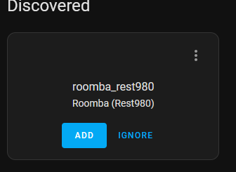
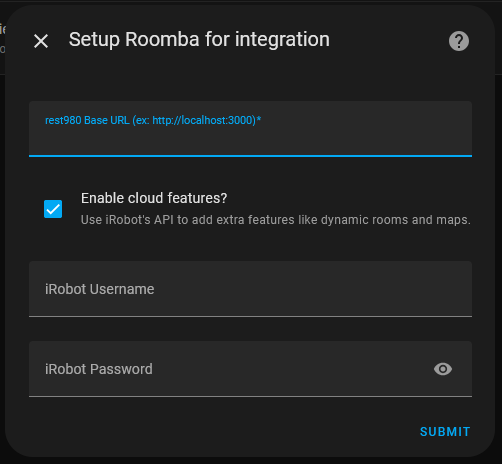
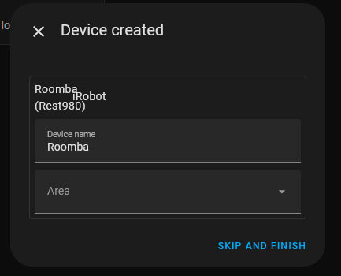
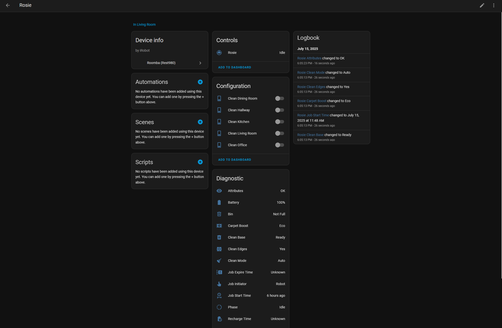
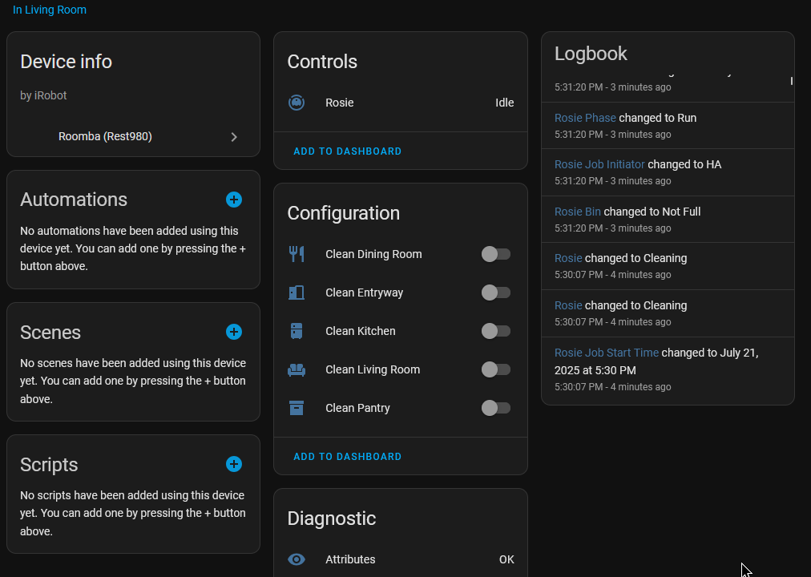
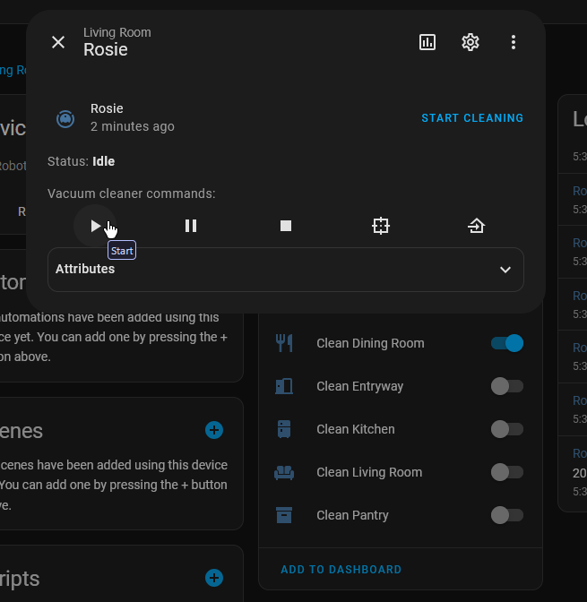

# roomba_rest980

Drop-in native integration/replacement for [jeremywillans/ha-rest980-roomba](https://github.com/jeremywillans/ha-rest980-roomba).

Still work in progress, but the vacuum entity has been fully ported over.

## Roadmap

- [x] Attribute parity with jeremywillans' YAML entry
- [x] Cloud API connection
  - [ ] Cloud MQTT connection
- [x] Actions
  - [x] Start
    - [ ] Clean all rooms by default
    - [x] Selective room cleaning
    - [ ] Two pass feature
  - [x] Pause
  - [ ] Unpause (Requires further testing)
  - [x] Return Home
  - [x] Stop
  - [x] Spot Clean
  - [ ] Mapping Run
- [x] Dynamically grab rooms and add them to the UI
  - [x] Grab room data (optional, cloud only)
  - [ ] Create map image

## Why?

I found that working with jeremywillans' implementation was nice and almost effortless, but I'd prefer to not have a YAML configuration and work with it by a more native integration that adds entities and isn't bound to making a lot of helpers per room.

## Setup

### Prerequisites / Recommendations

- HACS
- rest980
  - If you don't have it yet, don't worry; this guide will show you how to add it.
- Rooms mapped/setup in iRobot app
  - Note that everytime you remap and a room changes, it's ID may change (local users)!
- Knowledge of your Roomba and rest980 servers' IPs

> I recommend that you use [the lovelace-roomba-vacuum-card](https://github.com/jeremywillans/lovelace-roomba-vacuum-card) until I remake it for this integration.


## Step 1: Setting up rest980: Grab Robot Credentials

If you already have it setup, and you know its url (like `http://localhost:3000`), you may skip this step.  
First, you must gather your robot's on-device password and BLID (identifier).

> NOTE: You cannot have the iRobot app running on your phone, or anything else connected to it during this step!

<details open>
  <summary>
  For Docker users
  </summary>
Execute this command:  
```sh
docker run -it node sh -c "npm install -g dorita980 && get-roomba-password <robotIP>"
```
and follow the on-screen instructions.
</details>

<details>
  <summary>
  HA Addon by jeremywillans
  </summary>

Add `https://github.com/jeremywillans/hass-addons` to the Addons tab.
Locate and install the `roombapw` addon, following the included instructions.

</details>

<details>
  <summary>
  Other HA installation method
  </summary>

If you dont have direct access to Docker, you can clone and install the dorita980 package locally.  
See [dorita980's instructions on how to get the credentials](https://github.com/koalazak/dorita980#how-to-get-your-usernameblid-and-password).

</details>

### Setting up rest980: Bringing The Server Up

Now that you have your robot's IP, BLID, and password, we need to actually start rest980.

<details open>
  <summary>
  For Docker users (docker-compose)
  </summary>

[Download the docker-compose.yaml file, and bring the service up.](docker-compose.yaml)

To bring the service up (just rest980) and leave it in the background, run

```sh
docker-compose up -d rest980
```

You may also add the service to an existing configuration. You do not need to add file binds/mounts, as there are not any.

</details>

<details>
  <summary>
  HA Addon by jeremywillans
  </summary>

If you haven't, add `https://github.com/jeremywillans/hass-addons` to the Addons tab.
Locate and install the `rest980` addon, then update and save the configuration options with the credentials you got from the previous step.
> NOTE: Rest980 Firmware option 2 implies v2+ (inclusive of 3.x)

</details>

<details>
  <summary>
    Other HA installation method
  </summary>

  Clone and start the [rest980 server by koalazak, and note your computer's IP and port.](https://github.com/koalazak/rest980)

</details>

## Step 2: Setting up the Integration

rest980 will gather all the data about our robot, but the integration will format it perfectly, creating entities and a vacuum device.

<details open>
  <summary>
  For HACS users
  </summary>
  Add this custom repository, https://github.com/ia74/roomba_rest980 to HACS as an Integration. Search for the addon ("iRobot Roomba (rest980)") and install it!
</details>

<details>
  <summary>
  Manual installation
  </summary>
  Clone this repository, https://github.com/ia74/roomba_rest980 , and add the custom component folder (`roomba_rest980`) to your Home Assistant's `config/custom_components` folder.
</details>

When you install the integration and restart Home Assistant, you will notice it picking up your Roomba.



This is not due to your rest980 API server being discovered, rather the integration finding your Roomba on the local network.

> If you do not see this, that is okay; it only means HA was able to fully detect a roomba through it's network identifiers.

## Step 3: Adding your Roomba!

If you see the autodiscovered integration, press "Add"!  
You'll be presented with this popup. 



Input your rest980 server's url like so:

```
http://localhost:3000
```

and don't leave any trailing /s.

You may also input your iRobot credentials now, if you want to use cloud features that are coming soon. You must check "Enable cloud features?" for the cloud API to be used.

If you did it right, you'll see a success screen that has also gotten your given name for the Roomba!



If all has gone right, checking the device will show something like this:



## Step 3.5: Cloud issues.. (Cloud)

iRobot does some quite interesting things with their API. As of current, my implementation does not use the cloud MQTT server (yet). However, even with the iRobot app and every instance of a connection closed, you may get ratelimited (*sometimes*) with the error "No mqtt slot available". There isn't a workaround for this that I know of, except to restart HA/reload the robot's config entry in ~5 minutes.

## Step 4: Rooms! (Cloud)

Your rooms will be auto-imported, alongside a clean map view, much like the one from the app.  
This allows you to selectively clean rooms, and control it by automation (tutorial later).  
Rooms you select will be cleaned in the order you select. Two-pass functionailty coming soon as well.



Room types and names are also dynamically imported as to be expected.

To work with this, switch the "Clean (room)" switches on in the order you like, then press the Clean button from the vacuum's entity!



## Step 4: Rooms! (rest980 ONLY)

TO BE CONTINUED...
Rooms are not given to us easily when we're fully local, but a fix is in progress for that.

## Important Note

From this part on, the guide will not diverge into Cloud/Local unless required and will assume you are using Cloud features, but most of it should be generically implemented.

## Step 5: Robot Maintenance / Done!

> Unfortunately, this is not implemented yet, alongside any other action.

This integration will eventually support the maintenance function of the Roomba, but still is not implemented

## Backwards Compatibility

The integration adds all the attributes that you would expect from [jeremywillans implementation](https://github.com/jeremywillans/ha-rest980-roomba), making it compatible with [the lovelace-roomba-vacuum-card](https://github.com/jeremywillans/lovelace-roomba-vacuum-card).

You may see the code for this in [LegacyCompatibility.py](custom_components/roomba_rest980/LegacyCompatibility.py)


One minor issue is that the Vacuum entity only supports these states:
```
Cleaning: The vacuum is currently cleaning.
Docked: The vacuum is currently docked. It is assumed that docked can also mean charging.
Error: The vacuum encountered an error while cleaning.
Idle: The vacuum is not paused, not docked, and does not have any errors.
Paused: The vacuum was cleaning but was paused without returning to the dock.
Returning: The vacuum is done cleaning and is currently returning to the dock, but not yet docked.
Unavailable: The entity is currently unavailable.
Unknown: The state is not yet known.
```
Since the Roomba reports a much more extensive cycle/phase output, I added an attribute "extendedStatus" that gives you "Ready", "Training", "Spot".